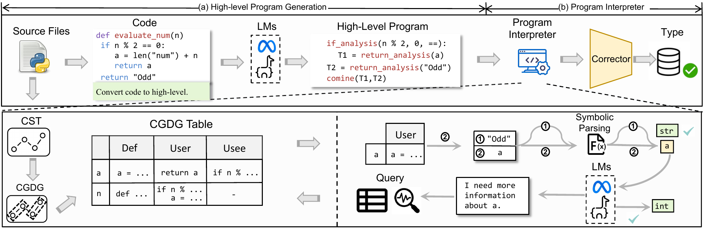

# Nester Dynamic Type Inference Tool Guide

This is the tool guide released for the paper "Neuro-Symbolic Language Models for Type Inference."

## Requirements

- Python >= 3.9
- Linux operating system

## Install

Clone this repository and run the following command in the root directory to install the required dependencies:

pip install -r requirements.txt

## Usage

1. To extract the file, use the following command:
   unzip data/data.zip -d path/to/data

2. Set up Llama and CodeLlama locally:
   - Llama: https://ai.meta.com/llama/
   - CodeLlama: https://ai.meta.com/blog/large-language-model-llama-codellama/

3. Run Nester on CodeLlama with the dataset using the following command:
   torchrun --nproc_per_node=1 nester.py --ckpt_dir=CodeLlama-7b-Instruct/ --tokenizer_path=CodeLlama-7b-Instruct/tokenizer.model --max_seq_len=2048 --max_batch_size=4

### Evaluate

To evaluate the Nester results, use the following command to calculate the Exact Match metric:

python nester/nester.py -s predictions.json -t testset.json -m -c

For match to parametric evaluation, simply add the `-i` option:

python nester/nester.py -s predictions.json -t testset.json -m -c -i

### Parameter Explanation

- `--nproc_per_node`: Specifies the number of processes per node. In this example, it is set to 1.
- `--ckpt_dir`: Specifies the directory path for the model checkpoint, ensuring pre-trained weights are loaded.
- `--tokenizer_path`: Specifies the path for the tokenizer used by the tool.
- `--max_seq_len`: Sets the maximum sequence length for the model. It is recommended to set this value to 2048 to ensure performance during inference.
- `--max_batch_size`: Specifies the maximum batch size. Adjust this value based on hardware resources and performance requirements to optimize computational efficiency.

### Environment Requirements

- PyTorch
- Hardware resources should be sufficient to support large-scale model computations. It is recommended to use a GPU to improve processing speed.

### Example Illustration

Below is an example illustration from Nester:

### References

For more information, refer to the official Nester documentation.

