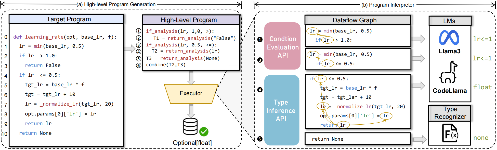

# Nester

This is the guide released for the paper "Neuro-Symbolic Language Models for Type Inference."

## Requirements

- Python >= 3.9
- Linux

## Install

Clone this repository and run the following command in the root directory to install the required dependencies:

```
pip install -r requirements.txt
```

## Usage

1. To extract the file, use the following command:
```
unzip data/data.zip -d path/to/data
```

3. Set up language models such as Llama and CodeLlama locally:
   - Llama: https://ai.meta.com/llama/
   - CodeLlama: https://ai.meta.com/blog/large-language-model-llama-codellama/

4. Run Nester on CodeLlama with the dataset using the following command:
```bash
torchrun --nproc_per_node=[number of nodes] nester.py --ckpt_dir=[checkpoint directory] --tokenizer_path=[tokenizer model path] --max_seq_len=[maximum sequence length] --max_batch_size=[maximum batch size]
```
The following command example shows how to set sequence length and batch size to run code with the codelama-7B-instruct version checkpoint and word divider:
```bash
torchrun --nproc_per_node=1 nester.py --ckpt_dir=CodeLlama-7b-Instruct/ --tokenizer_path=CodeLlama-7b-Instruct/tokenizer.model --max_seq_len=2048 --max_batch_size=4
```
This command executes the 'nester.py' script on a single processing node, using the specified checkpoint directory and the classifier model path, while setting the maximum sequence length to 2048 and the batch size to 4.

### Evaluate

To evaluate the Nester results, use the following command to calculate the Exact Match metric:

```
python nester/evaluate.py -s predictions.json -t testset.json -m -c
```

For match to parametric evaluation, simply add the `-i` option:

```
python nester/evaluate.py -s predictions.json -t testset.json -m -c -i
```


### Environment Requirements

- PyTorch

### Example Illustration

Below is an example illustration from Nester:



### Results

We include the predictions of Nester in our dataset and its ablation results in the ```predictions/``` folder.

